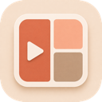

<p align="center">
  
</p>

# 🎬 Perfect Collage

> A fast, visual macOS and Windows app for turning photos and videos into polished grid collages.

[繁體中文版](docs/README.zh-TW.md)

Perfect Collage is built for comparisons, social posts, multi-camera views, and quick montage layouts. Arrange your media, preview the result, and export—without working through a full video-editing timeline.

## ✨ Highlights

- Import multiple photos and videos, including drag and drop.
- Arrange clips in a customizable grid or let Auto Layout do it for you.
- Add editable clip labels with flexible position, size, padding, and visual styles.
- Preview clips together or play videos one by one.
- Control aspect ratio, resolution, borders, corners, colors, audio, and duration.
- Export photo-only collages as `JPG`; export projects containing video as `MP4`.
- Track recent exports and quickly open files or reveal them in Finder.
- Get a quiet in-app notification when a newer GitHub Release is available.
- Reset individual sections or use **Reset All** to start fresh.

## 🚀 Quick Start

1. Click **Add Media**, or drag files into the app.
2. Choose a grid and output aspect ratio.
3. Arrange clips in Preview and customize labels.
4. Select **Together** or **One by one**, then adjust audio and duration.
5. Click **Export JPG** or **Export MP4**.

## 📦 Supported Media

- Video: `mp4`, `mov`, `m4v`, `avi`, `mkv`, `webm`
- Image: `jpg`, `jpeg`, `png`, `webp`, `heic`, `heif`

Format support may also depend on the codecs available on the host platform.

## 🛠 Development

Requirements: Flutter plus the native desktop toolchain for your platform.

```bash
flutter pub get
flutter run -d macos
# On Windows:
flutter run -d windows
```

Run checks:

```bash
flutter analyze
flutter test
```

Build the macOS app:

```bash
flutter build macos
```

Build and package the Windows x64 app (run on Windows):

```powershell
.\scripts\build_windows_release.ps1
```

Windows builds cannot be cross-compiled locally from macOS. Use a Windows
machine/VM or publish a tag and let the GitHub Actions Windows runner create the
release ZIP automatically.

For packaging and release instructions, see [Releasing Perfect Collage](docs/releasing.md).

## 🎯 Scope

Perfect Collage is a focused collage editor, not a timeline-based replacement for a full video editor. Its goal is simple: arrange multiple media items, preview them clearly, and export quickly.
